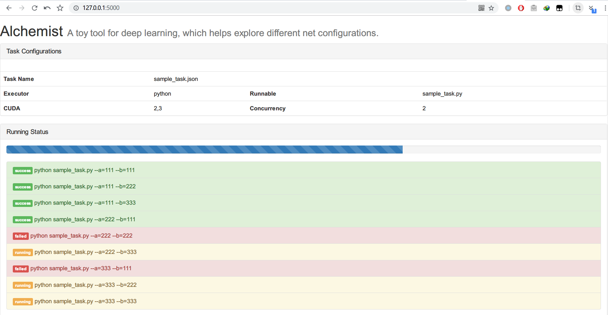

# Alchemist

> UNSTABLE YET.
> AN HAPPY 2019 COMMIT
> DO NOT USE IT. :)


A toy tool for deep learning, which helps explore different net configurations. Note that this tool is still in development.

- [x] Enumerate different configurations
- [x] Specify which GPU card to use
- [x] Specify the number of processes
- [x] Web UI support

## Installation

`python setup.py install`

## Usage

- Configuration

Configuration of a task is stored in `task_name.json`.

- Running

`alchemist --task=sample_task.json`

You can view the running status via "http://127.0.0.1:5000" (**the port number may differs**, you can get the port number from the command line)



- Results

Stored in `task_name.json.logs`. `stdout`/`stderr` are redirected to `task-[index].txt`.

## Configuration

```
{
  "executor": "python3",   # python interpreter
  "runnable": "some.py",   # the runnable file
  "cuda": [0, 1],          # [-1 if not using cuda] cuda index to use
  "concurrency": 2,        # number of multi-processes 
  "configs": {
    "==base==": {          # basic configurations
      "--word-emb": [50, 100]
    },
    "==more==": [          # [can be empty] some different configurations
      {                    # supposing using lstm as the representation layer
        "--use-lstm": True,
        "--lstm-hidden": 200
        ...
      },
      {                    # supposing using transformer as the representation layer
        "--use-transformer": True,
        "--num-head": 8,
        "--num-layer": 6,
        ...
      }
    ]
  }
}
```
